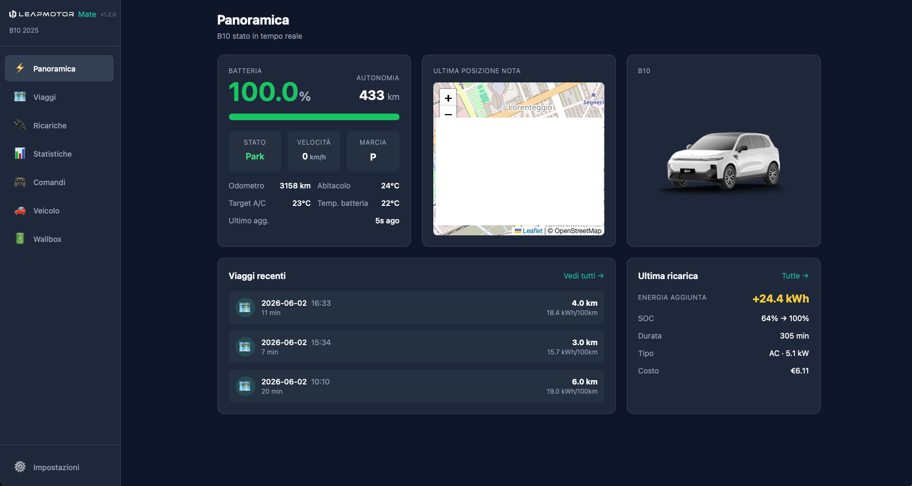
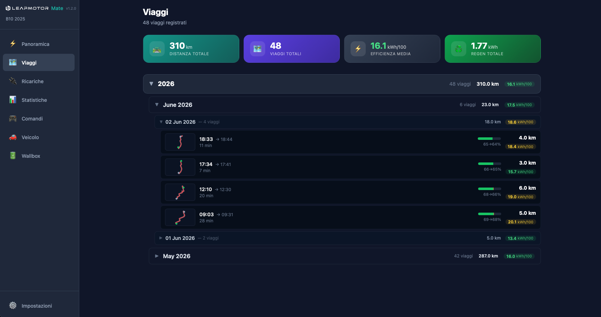
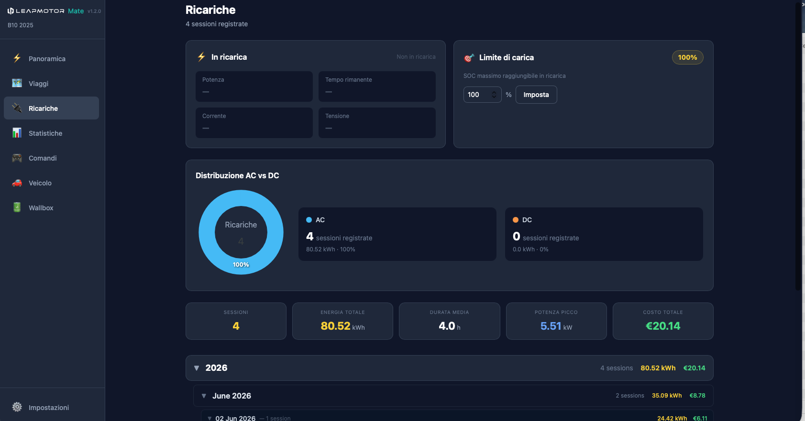
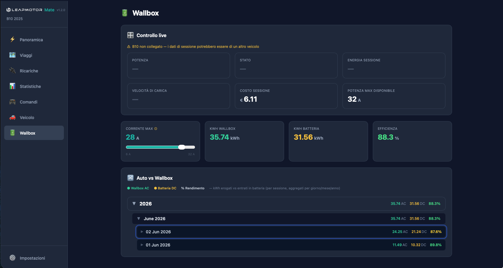
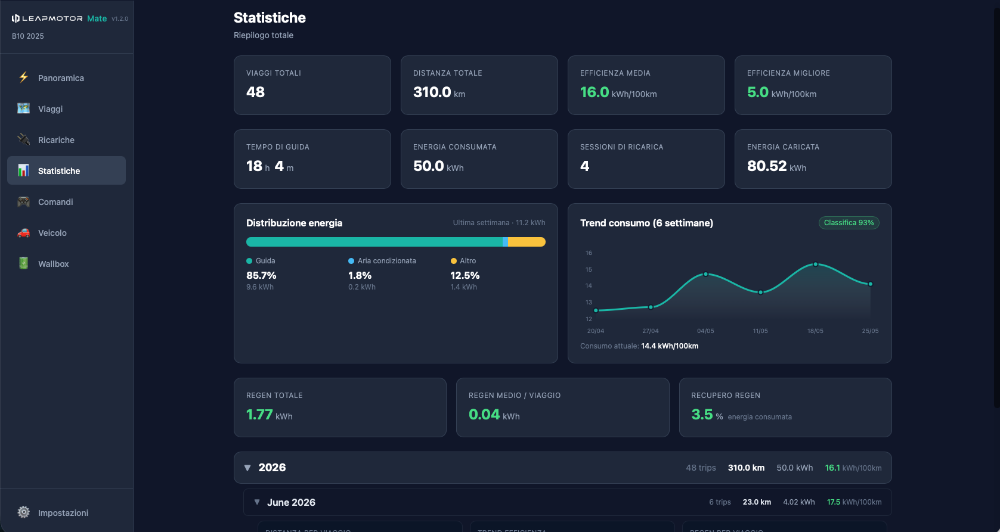
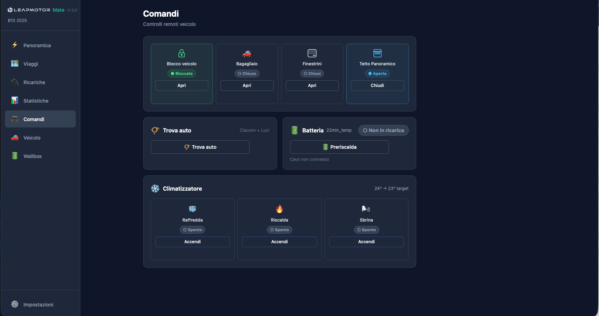

# LeapMotor Mate

**Trip tracking, charge logging and remote control for Leapmotor vehicles** — a self‑hosted companion (think *TeslaMate* for Leapmotor). Runs as a **Home Assistant add‑on** or as a **standalone Docker** container.

Supported models: **B10 · C10 · T03** (European spec).

> 🇮🇹 [Versione italiana più sotto.](#leapmotor-mate--italiano)

## Screenshots

| Overview | Trips |
|---|---|
|  |  |
| **Charges** | **Wallbox** |
|  |  |
| **Statistics** | **Commands** |
|  |  |

---

## Features

- **Overview** — live status, battery, range, location map, vehicle picture.
- **Trips** — automatic trip detection with route map, distance, energy, efficiency and regen. Each trip also shows its **total kWh consumed** and its **cost** (energy × the price per kWh of the last charge before the trip, in your currency).
- **Charges** — charge sessions with AC/DC detection, energy added, power and a distribution chart.
- **🆕 Charge prices** — flat 24h pricing or **time-of-use bands**: set prices per time window, per **day of the week** and per charge type, and each session is costed correctly (energy split across the bands it spans by the real power curve).
- **Wallbox (optional)** — pair a wallbox already in Home Assistant to see live charging power/status, set the max charging current, and compare **AC delivered by the wallbox** vs **DC into the battery** per session, with charging efficiency.
- **ABRP (optional)** — forward live telemetry to **A Better Route Planner** for live route planning (enable it with your ABRP token).
- **MQTT → Home Assistant (optional)** — publish the car to Home Assistant via **MQTT Discovery** as native entities (sensors, binary sensors, GPS tracker) plus command buttons.
- **Statistics** — driving/AC/other energy split and a 6‑week consumption trend (from the Leapmotor cloud).
- **Remote control** — lock, windows, trunk, panoramic roof, climate, find car, battery preheat.
- **🆕 Navigation** — search an address and **send the destination straight to the car's built‑in navigation**. Shows the car's current address too. Address lookup is keyless by default (OpenStreetMap) with an optional API key (Geoapify/LocationIQ/TomTom) for better house‑number coverage.
- **Independent** — polls the Leapmotor cloud directly (configurable 10–30 s). No dependency on the phone app or Home Assistant; polling the cloud does **not** wake or drain the car.
- **Multilingual UI** — English · Italiano · Français · Deutsch.
- **🆕 Currency** — pick your display currency from 30 world currencies (€, $, £, CHF, kr, zł…); every cost reformats to it, with the right symbol placement and decimals.

## How it works

```
Leapmotor Cloud  ──►  Poller (state machine)  ──►  SQLite  ──►  Web UI (FastAPI + HTMX)
                       trips / charges / regen                   + remote commands
```

The data lives in a local SQLite database. Nothing is sent anywhere except to the official Leapmotor cloud.

---

## Requirements

1. **A Leapmotor account.** ⚠️ **Use a *dedicated* account, not the one on your phone.** The Leapmotor cloud binds a session per device, so a second client can evict your phone (or vice‑versa). Create a separate account and share the car with it from the official app.
2. **The Leapmotor app TLS certificate** (`app.crt` + `app.key`). This is the *same for everyone* (it identifies the Leapmotor app, not you) and is **not** included in this repository. Download the two files from:

   👉 **https://github.com/markoceri/leapmotor-certs**

   You upload them once during the setup wizard (see below).

---

## Installation

### Option A — Home Assistant add‑on

1. In Home Assistant: **Settings → Apps → Install app → ⋮ → Repositories** (on Home Assistant before 2026.2: **Settings → Add‑ons → Add‑on Store → ⋮ → Repositories**), and add the repository URL (note the `-addon` suffix — this is a separate repo from the code):

   ```
   https://github.com/ProtossBlaster/leapmotor-mate-addon
   ```

2. Install **LeapMotor Mate**, start it, and open the panel (car icon in the sidebar).
3. Follow the setup wizard.

The database is stored in the add‑on's persistent `/data`, so it survives restarts and updates.

### Option B — Standalone Docker

```bash
git clone https://github.com/ProtossBlaster/leapmotor-mate.git
cd leapmotor-mate
docker compose up -d
```

Then open **http://localhost:4000** and follow the setup wizard.

The database is stored in `./data/` (mounted at `/data` in the container).

---

## Setup wizard

The first launch walks you through two steps:

1. **Certificate** — upload `app.crt` and `app.key` (or paste their PEM text). Get them from [markoceri/leapmotor-certs](https://github.com/markoceri/leapmotor-certs). Stored persistently in `/data/certs`.
2. **Login** — your Leapmotor account email, password and operation **PIN**. The wizard auto‑detects your model and battery (EU spec).

That's it — the poller starts and data begins to appear.

## Configuration

Everything is configured from the web UI (**Settings**), no YAML needed:

- **Polling interval** — parked (default 30 s) and driving (default 10 s). Faster catches trips/charges sooner; slower means fewer API calls. Polling the cloud does not wake or drain the car.
- **Charge prices** — flat or time-of-use, on the dedicated *Charge Prices* page (see below).
- **Language & currency** — English / Italiano / Français / Deutsch, and your display currency (€, $, £, CHF… 30 currencies). The number format (decimal/thousands separator) follows the selected language.

### Charge prices

Set what each kWh costs on the dedicated **Charge Prices** page (💰 in the sidebar), so Mate prices your sessions. Two modes:

- **Fixed (24h)** — one price per charge type (Home / AC / DC / HPC).
- **Time-of-use bands** — add one or more time windows, choose the **days of the week** each applies to (All / Weekdays / Weekend shortcuts), and set a price per charge type for every band. Leave a price blank to fall back to the base price, or enter `0` if it's free in that band. A session spanning two bands is split by its real power curve, and one crossing midnight on a Sat→Sun boundary is priced per day correctly.

Cost changes apply to **new charges only**: a charge's cost is frozen when you confirm its type, so editing prices or bands later never changes past sessions.

### Optional: boost from Home Assistant

If you run Home Assistant on the same network, you can trigger a temporary fast‑poll when a trip is about to start (e.g. from a Bluetooth/phone shortcut) by calling `POST http://<mate-host>:4000/api/boost`. With the default 30 s cadence this is optional.

### Wallbox (Home Assistant)

If you charge at home and have a **wallbox already integrated in Home Assistant** (Wallbox Pulsar, Easee, go‑e, Keba, OCPP, …), Mate can pair with it to show live charging data and compare what the **wallbox delivers (AC)** with what the **car receives into the battery (DC)**.

Enable it in **Settings → Wallbox present**, then connect to Home Assistant. How you connect depends on how you run Mate:

- **As a Home Assistant add‑on** — *nothing to configure.* Mate reaches HA through the internal Supervisor API automatically, regardless of how HA is exposed externally (HTTP, HTTPS, Nabu Casa). You'll just see a green **connection status** dot.
- **As standalone Docker** — enter your HA URL (e.g. `http://192.168.1.10:8123`) and a **Long‑Lived Access Token** (HA → your profile → *Security* → *Long‑Lived Access Tokens* → *Create Token*). Local HTTPS, even with a self‑signed certificate, works.

Then expand **Entity mapping** and assign the wallbox sensors (power, energy, status, max current, charging speed, max available power). Mate pre‑selects them automatically and only lists your wallbox device's own entities, so you don't have to scroll through every Home Assistant sensor.

What you get on the new **Wallbox** page:
- a **live panel** (power, status, session energy, charging speed, max available power) plus the session cost (reused from your home charges);
- a **max‑current control** to set the wallbox charging current — note your own HA load‑balancing automations may override it;
- an **AC‑vs‑DC comparison** per charge session (kWh delivered vs into the battery + efficiency), laid out as a year/month/day history; expand a session for its power chart. The wallbox curve uses Home Assistant's history (kept ~10 days), so the comparison appears for recent sessions.

### ABRP (A Better Route Planner)

Forward the car's live data to **A Better Route Planner** for live route planning. In **Settings → ABRP**, enable it and paste your personal ABRP token (in the ABRP app: *Settings → Car → Live Data*, "Generic"). It's off until you enable it, and nothing is sent without a token.

### MQTT → Home Assistant

Publish the car to Home Assistant as **native entities** (in parallel to the Mate UI), via MQTT Discovery. In **Settings → MQTT**, enable it and enter your broker (host, port, username/password; TLS optional). Home Assistant then auto‑creates a *Leapmotor Mate* device with sensors (SOC, range, individual tyres, temperatures, charge…), binary sensors (doors/windows/lock/charging), a GPS tracker, and command buttons (lock/unlock, trunk, find car, and climate — Quick Cool / Quick Heat / Defrost / A/C Off). Turning the A/C fully **off** is best‑effort — the vehicle cloud doesn't always honour it (an open issue with the API). Works with any MQTT broker (e.g. the Mosquitto add‑on). Use **Test connection** to verify the broker before saving. After a command the state now updates in Home Assistant immediately (no waiting for the next poll), and the **topic prefix** scopes the device — so you can run a second instance on a different prefix without it clashing with the first.

---

## Notes & disclaimer

- **"Vehicle not reporting live data" in the logs is normal.** When the car is parked long enough it goes into **deep sleep** and the cloud returns no live signals. Mate backs off to 15‑minute polling (logged once, not every cycle) and recovers automatically the moment the car reports again — when it's driven, or woken by the official Leapmotor app. To be sure a short trip is captured even straight out of deep sleep, use the boost trigger above.
- **Your credentials are encrypted at rest.** The Leapmotor password/PIN (and any HA / ABRP / MQTT / geocoder tokens) are stored encrypted in the local database, with a per‑install key in `/data/secret.key` (auto‑generated, or set your own via the `MATE_SECRET_KEY` env var). ⚠️ Keep `secret.key` together with your backups — restoring only the database without it will ask you to re‑enter the credentials.
- **Standalone: optional login.** When running standalone (not as an add‑on), set the `MATE_AUTH_PASSWORD` environment variable to require a password to open the app — useful if it's reachable beyond localhost. As a Home Assistant add‑on this is unnecessary (ingress already authenticates) and is ignored.
- Use a **dedicated Leapmotor account** (see Requirements).
- This is an **unofficial** project, not affiliated with Leapmotor. It relies on reverse‑engineered cloud APIs and may break if Leapmotor changes them. Use at your own risk.
- Built on the [`leapmotor-api`](https://github.com/markoceri/leapmotor-api) Python client.

## ☕ Support

LeapMotor Mate is free and open-source, developed in my spare time. If it's useful to you, you can support its development with a coffee — thank you! ☕

<a href="https://www.buymeacoffee.com/protossblaster" target="_blank"></a>

## Credits

- [`kerniger/leapmotor-ha`](https://github.com/kerniger/leapmotor-ha) — original Leapmotor cloud API reverse-engineering / Home Assistant integration.
- [`markoceri/leapmotor-api`](https://github.com/markoceri/leapmotor-api) — Python cloud client.
- [`markoceri/leapmotor-certs`](https://github.com/markoceri/leapmotor-certs) — app certificate.
- Inspired by [TeslaMate](https://github.com/teslamate-org/teslamate) and the Leapmotor Home Assistant integrations.

## License

[GNU AGPL‑3.0](./LICENSE) © Silvio Bressani.

---
---

# LeapMotor Mate · Italiano

**Tracciamento viaggi, registro ricariche e controllo remoto per veicoli Leapmotor** — un companion self‑hosted (un *TeslaMate* per Leapmotor). Funziona come **add‑on di Home Assistant** o come **container Docker standalone**.

Modelli supportati: **B10 · C10 · T03** (spec. europea).

## Schermate

| Panoramica | Viaggi |
|---|---|
|  |  |
| **Ricariche** | **Wallbox** |
|  |  |
| **Statistiche** | **Comandi** |
|  |  |

## Funzionalità

- **Panoramica** — stato live, batteria, autonomia, mappa posizione, immagine del veicolo.
- **Viaggi** — rilevamento automatico con mappa del percorso, distanza, energia, efficienza e regen. Ogni viaggio mostra anche i **kWh totali consumati** e il **costo** (energia × prezzo per kWh dell'ultima ricarica prima del viaggio, nella tua valuta).
- **Ricariche** — sessioni con rilevamento AC/DC, energia aggiunta, potenza e grafico di distribuzione.
- **🆕 Prezzi di ricarica** — prezzo fisso 24h o **fasce orarie**: prezzi per fascia, per **giorno della settimana** e per tipo di ricarica, e ogni sessione viene calcolata correttamente (energia ripartita tra le fasce attraversate dalla curva di potenza reale).
- **Wallbox (opzionale)** — abbina una wallbox già presente in Home Assistant per vedere potenza/stato di carica live, impostare la corrente max e confrontare l'**AC erogato dalla wallbox** con il **DC entrato in batteria** per sessione, col rendimento di carica.
- **ABRP (opzionale)** — invia la telemetria live ad **A Better Route Planner** per la pianificazione dei percorsi (attivala col tuo token ABRP).
- **MQTT → Home Assistant (opzionale)** — pubblica l'auto a Home Assistant via **MQTT Discovery** come entità native (sensori, binary sensor, tracker GPS) più pulsanti comando.
- **Statistiche** — ripartizione energia guida/clima/altro e trend consumo a 6 settimane (dal cloud Leapmotor).
- **Controllo remoto** — blocco, finestrini, bagagliaio, tetto panoramico, clima, trova auto, preriscaldo batteria.
- **🆕 Navigazione** — cerca un indirizzo e **invia la destinazione direttamente al navigatore di bordo dell'auto**. Mostra anche l'indirizzo attuale dell'auto. La ricerca indirizzi funziona senza chiave (OpenStreetMap) con una chiave API opzionale (Geoapify/LocationIQ/TomTom) per una copertura migliore dei civici.
- **Indipendente** — interroga direttamente il cloud Leapmotor (configurabile 10–30 s). Nessuna dipendenza dall'app o da Home Assistant; interrogare il cloud **non** sveglia né scarica l'auto.
- **UI multilingua** — Italiano · English · Français · Deutsch.
- **🆕 Valuta** — scegli la valuta di visualizzazione tra 30 valute mondiali (€, $, £, CHF, kr, zł…); ogni costo si riformatta con simbolo e decimali corretti.

## Come funziona

```
Cloud Leapmotor  ──►  Poller (state machine)  ──►  SQLite  ──►  Web UI (FastAPI + HTMX)
                       viaggi / ricariche / regen              + comandi remoti
```

I dati restano in un database SQLite locale. Nulla viene inviato altrove se non al cloud ufficiale Leapmotor.

## Requisiti

1. **Un account Leapmotor.** ⚠️ **Usa un account *dedicato*, non quello del telefono.** Il cloud Leapmotor lega una sessione per dispositivo: un secondo client può sfrattare il telefono (e viceversa). Crea un account separato e condividi l'auto con esso dall'app ufficiale.
2. **Il certificato TLS dell'app Leapmotor** (`app.crt` + `app.key`). È *uguale per tutti* (identifica l'app, non te) e **non** è incluso in questo repository. Scarica i due file da:

   👉 **https://github.com/markoceri/leapmotor-certs**

   Li carichi una volta sola durante il wizard di setup.

## Installazione

### Opzione A — Add‑on Home Assistant

1. In Home Assistant: **Impostazioni → Applicazioni → Installa app → ⋮ → Archivi digitali** (su Home Assistant prima della 2026.2: **Impostazioni → Add‑on → Store → ⋮ → Repository**), e aggiungi l'URL del repository (nota il suffisso `-addon` — è un repo separato dal codice):

   ```
   https://github.com/ProtossBlaster/leapmotor-mate-addon
   ```

2. Installa **LeapMotor Mate**, avvialo e apri il pannello (icona auto nella barra laterale).
3. Segui il wizard di setup.

Il database è salvato nella `/data` persistente dell'add‑on, quindi sopravvive a riavvii e aggiornamenti.

### Opzione B — Docker standalone

```bash
git clone https://github.com/ProtossBlaster/leapmotor-mate.git
cd leapmotor-mate
docker compose up -d
```

Poi apri **http://localhost:4000** e segui il wizard.

Il database è salvato in `./data/` (montato su `/data` nel container).

## Wizard di setup

Al primo avvio due passi:

1. **Certificato** — carica `app.crt` e `app.key` (oppure incolla il testo PEM). Li trovi su [markoceri/leapmotor-certs](https://github.com/markoceri/leapmotor-certs). Salvati in modo persistente in `/data/certs`.
2. **Login** — email account Leapmotor, password e **PIN** operativo. Il wizard rileva automaticamente modello e batteria (spec. EU).

Fatto — il poller parte e i dati iniziano a comparire.

## Configurazione

Tutto si configura dalla UI web (**Impostazioni**), senza YAML:

- **Intervallo di polling** — parcheggiata (default 30 s) e in marcia (default 10 s). Più veloce rileva prima viaggi/ricariche; più lento riduce le chiamate. Interrogare il cloud non sveglia né scarica l'auto.
- **Prezzi di ricarica** — fisso o a fasce orarie, dalla pagina dedicata *Prezzi di ricarica* (vedi sotto).
- **Lingua e valuta** — Italiano / English / Français / Deutsch, e la valuta di visualizzazione (€, $, £, CHF… 30 valute). Il formato numero (separatore decimale/migliaia) segue la lingua selezionata.

### Prezzi di ricarica

Imposta quanto costa ogni kWh dalla pagina dedicata **Prezzi di ricarica** (💰 nella barra laterale), così Mate calcola il costo delle ricariche. Due modalità:

- **Fisso (24h)** — un prezzo per tipo di ricarica (Home / AC / DC / HPC).
- **Fasce orarie** — aggiungi una o più fasce, scegli i **giorni della settimana** in cui valgono (scorciatoie Tutti / Feriali / Weekend) e imposta un prezzo per tipo di ricarica per ogni fascia. Lascia un prezzo vuoto per usare il prezzo base, oppure metti `0` se in quella fascia è gratis. Una sessione a cavallo di due fasce viene ripartita dalla sua curva di potenza reale, e una che attraversa la mezzanotte sab→dom è tariffata per giorno correttamente.

Le modifiche ai costi valgono solo per le **ricariche future**: il costo si congela alla conferma del tipo, quindi cambiare prezzi o fasce non altera le sessioni già fatte.

### Opzionale: boost da Home Assistant

Se hai Home Assistant sulla stessa rete, puoi attivare un polling veloce temporaneo all'inizio di un viaggio (es. da uno shortcut Bluetooth/telefono) chiamando `POST http://<host-mate>:4000/api/boost`. Con la cadenza di default a 30 s è opzionale.

### Wallbox (Home Assistant)

Se ricarichi a casa e hai una **wallbox già integrata in Home Assistant** (Wallbox Pulsar, Easee, go‑e, Keba, OCPP, …), Mate può abbinarla per mostrare i dati di ricarica live e confrontare ciò che la **wallbox eroga (AC)** con ciò che l'**auto riceve in batteria (DC)**.

Attivala in **Impostazioni → Wallbox presente**, poi connettiti a Home Assistant. Come ti connetti dipende da come esegui Mate:

- **Come add‑on di Home Assistant** — *niente da configurare.* Mate raggiunge HA tramite l'API interna del Supervisor in automatico, a prescindere da come HA è esposto all'esterno (HTTP, HTTPS, Nabu Casa). Vedrai solo lo **stato connessione** con la pallina verde.
- **Come Docker standalone** — inserisci l'URL di HA (es. `http://192.168.1.10:8123`) e un **Long‑Lived Access Token** (HA → tuo profilo → *Sicurezza* → *Token di accesso Long‑Lived* → *Crea token*). L'HTTPS locale, anche con certificato self‑signed, funziona.

Poi espandi **Mappatura entità** e assegna i sensori della wallbox (potenza, energia, stato, corrente max, velocità di carica, potenza max disponibile). Mate li pre‑seleziona da solo e mostra solo le entità del tuo dispositivo wallbox, così non devi scorrere tutti i sensori di Home Assistant.

Cosa ottieni nella nuova pagina **Wallbox**:
- un **pannello live** (potenza, stato, energia sessione, velocità di carica, potenza max disponibile) più il costo sessione (riusato dalle tue ricariche home);
- un **controllo della corrente max** per impostare la corrente di carica della wallbox — nota che le tue automazioni HA di bilanciamento del carico potrebbero sovrascriverlo;
- un **confronto AC‑vs‑DC** per sessione (kWh erogati vs entrati in batteria + rendimento), come storico anno/mese/giorno; espandi una sessione per il grafico di potenza. La curva wallbox usa lo storico di Home Assistant (conservato ~10 giorni), quindi il confronto compare per le sessioni recenti.

### ABRP (A Better Route Planner)

Invia i dati live dell'auto ad **A Better Route Planner** per la pianificazione dei percorsi. In **Impostazioni → ABRP**, attivala e incolla il tuo token ABRP personale (nell'app ABRP: *Impostazioni → Auto → Dati live*, "Generic"). È disattivata finché non la abiliti, e non invia nulla senza token.

### MQTT → Home Assistant

Pubblica l'auto a Home Assistant come **entità native** (in parallelo all'interfaccia di Mate), via MQTT Discovery. In **Impostazioni → MQTT**, attivala e inserisci il tuo broker (host, porta, utente/password; TLS opzionale). Home Assistant crea automaticamente un dispositivo *Leapmotor Mate* con sensori (SOC, autonomia, gomme singole, temperature, carica…), binary sensor (porte/finestrini/serratura/ricarica), un tracker GPS, e pulsanti comando (lock/unlock, baule, trova auto, e clima — Quick Cool / Quick Heat / Defrost / A/C Off). Lo spegnimento **completo** dell'A/C è best‑effort — il cloud dell'auto non sempre lo onora (problema aperto con l'API). Funziona con qualsiasi broker MQTT (es. l'add‑on Mosquitto). Usa **Prova connessione** per verificare il broker prima di salvare. Dopo un comando lo stato ora si aggiorna in Home Assistant all'istante (senza aspettare il polling successivo), e il **prefisso topic** delimita il dispositivo — così puoi far girare una seconda istanza con un prefisso diverso senza che entri in conflitto con la prima.

## Note e disclaimer

- **Il messaggio "Vehicle not reporting live data" nei log è normale.** Quando l'auto resta parcheggiata abbastanza a lungo va in **deep sleep** e il cloud non restituisce segnali live. Mate passa al polling ogni 15 minuti (loggato una volta sola, non ad ogni ciclo) e si riprende da solo appena l'auto torna a riportare — quando viene guidata, o svegliata dall'app ufficiale Leapmotor. Per essere sicuro di registrare anche un viaggio breve subito dopo il deep sleep, usa il trigger boost qui sopra.
- **Le tue credenziali sono cifrate a riposo.** La password/PIN Leapmotor (e gli eventuali token HA / ABRP / MQTT / geocoder) sono salvati cifrati nel database locale, con una chiave per‑installazione in `/data/secret.key` (auto‑generata, oppure la tua tramite la variabile `MATE_SECRET_KEY`). ⚠️ Conserva `secret.key` insieme ai backup — ripristinando solo il database senza la chiave dovrai re‑inserire le credenziali.
- **Standalone: login opzionale.** In modalità standalone (non add‑on), imposta la variabile d'ambiente `MATE_AUTH_PASSWORD` per richiedere una password all'apertura dell'app — utile se è raggiungibile oltre localhost. Come add‑on Home Assistant non serve (l'ingress autentica già) e viene ignorata.
- Usa un **account Leapmotor dedicato** (vedi Requisiti).
- Progetto **non ufficiale**, non affiliato a Leapmotor. Usa API cloud ricavate per reverse‑engineering e può smettere di funzionare se Leapmotor le cambia. Usalo a tuo rischio.
- Basato sul client Python [`leapmotor-api`](https://github.com/markoceri/leapmotor-api).

## ☕ Sostieni il progetto

LeapMotor Mate è gratuito e open-source, sviluppato nel tempo libero. Se ti è utile, puoi sostenerne lo sviluppo con un caffè — grazie! ☕

<a href="https://www.buymeacoffee.com/protossblaster" target="_blank"></a>

## Licenza

[GNU AGPL‑3.0](./LICENSE) © Silvio Bressani.
