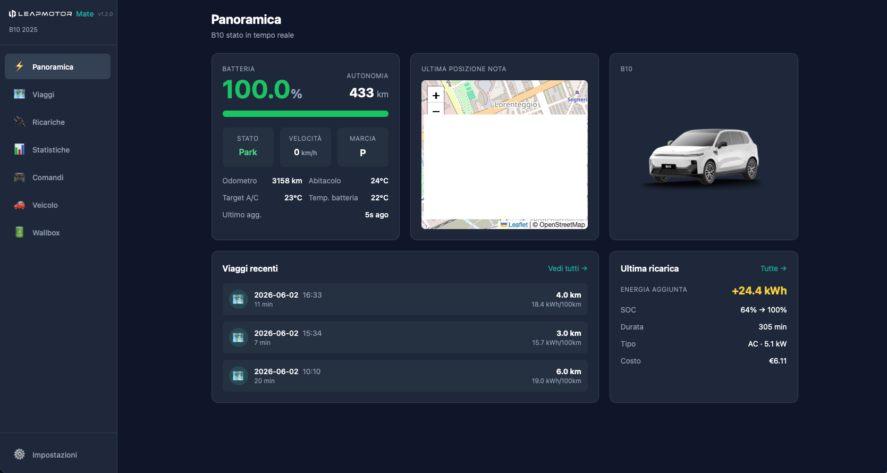
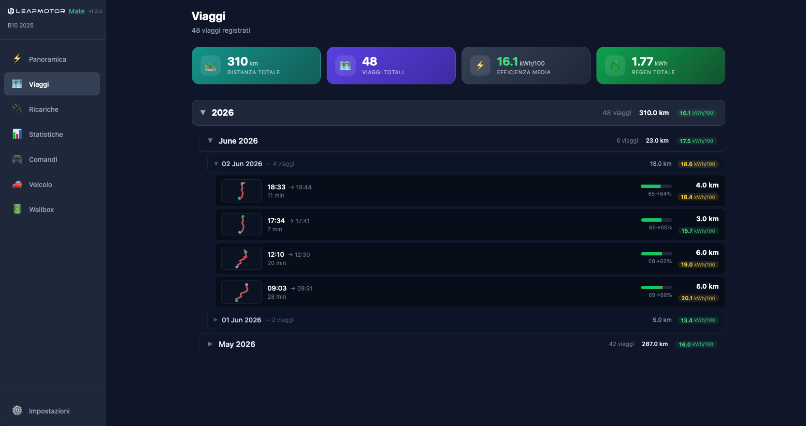
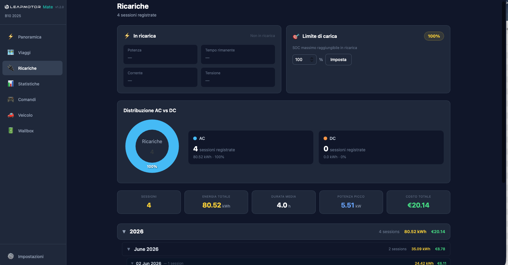
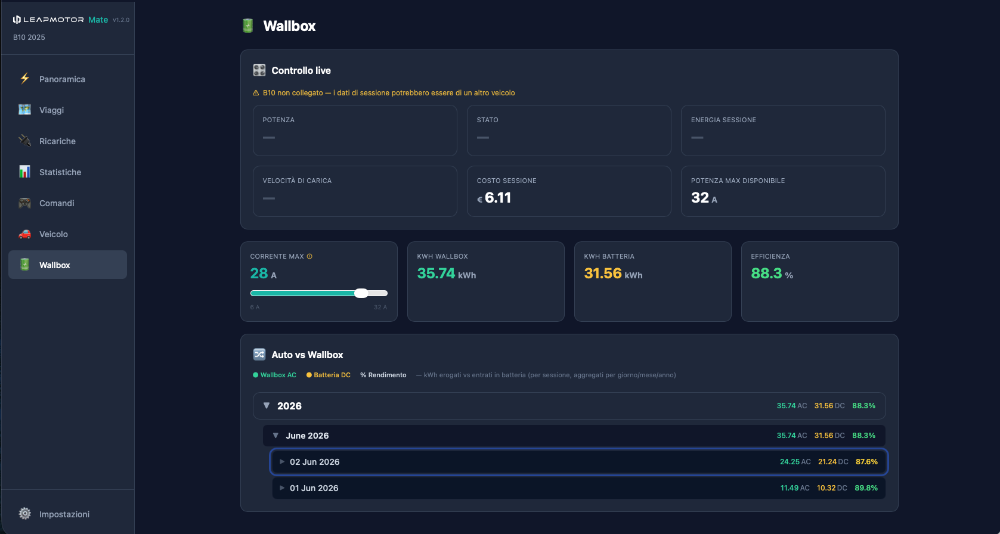
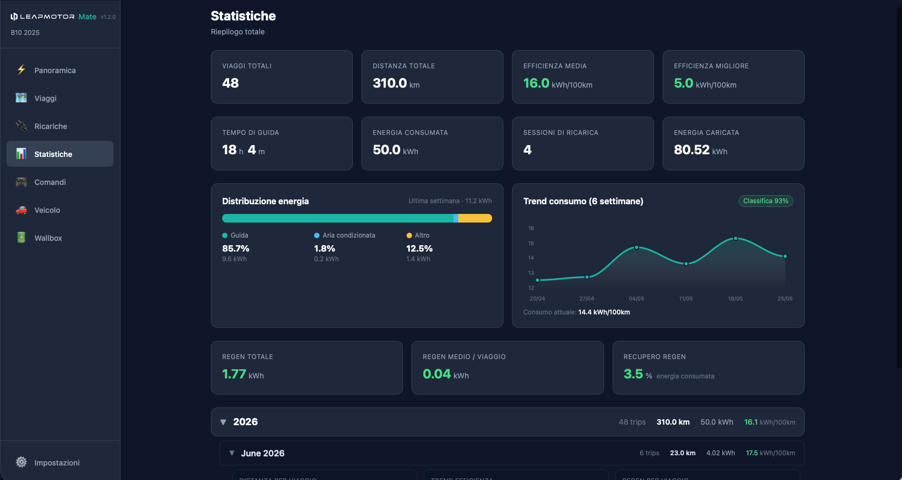
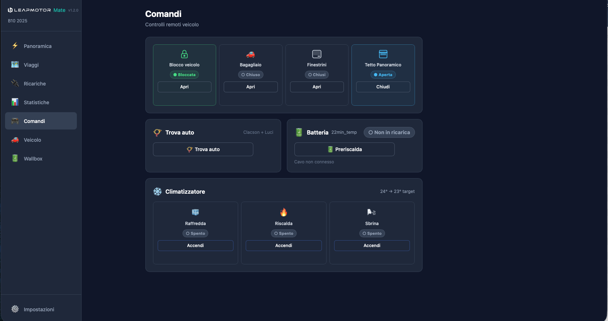

# LeapMotor Mate

**v3.15.9:** fixed B05 live vehicle and charge-plan reads through the working status path.
See [release notes and upgrade impact](docs/releases/v3.15.9.md).

[](https://github.com/ProtossBlaster/leapmotor-mate/actions/workflows/ci.yml)
[](https://github.com/ProtossBlaster/leapmotor-mate/actions/workflows/docker-publish.yml)
[](https://hub.docker.com/r/protossblaster/leapmotor-mate)
[](https://github.com/ProtossBlaster/leapmotor-mate/releases)
[](LICENSE)
[](https://github.com/ProtossBlaster/leapmotor-mate/stargazers)


**Trip tracking, charge logging and remote control for Leapmotor vehicles** — a self‑hosted companion (think *TeslaMate* for Leapmotor). Runs as a **Home Assistant add‑on** or as a **standalone Docker** container.

Supported models: **B05 · B10 · C10 · T03** — full‑electric (BEV) only, European spec (the Leapmotor lineup distributed by Stellantis/Leapmotor). Not for REEV / range‑extender versions.

> 🇮🇹 [Versione italiana più sotto.](#leapmotor-mate--italiano)

## ☕ Support

LeapMotor Mate is free and open-source, developed in my spare time. If it's useful to you, you can support its development with a coffee — thank you! ☕

<a href="https://www.buymeacoffee.com/protossblaster" target="_blank"></a>
<a href="https://www.paypal.me/ProtossBlaster" target="_blank"></a>

## Screenshots

| Overview | Trips |
|---|---|
|  |  |
| **Charges** | **Wallbox** |
|  |  |
| **Statistics** | **Commands** |
|  |  |

---

## Features

**At a glance**
- **Overview** — live status, battery, range, **READY state**, location map and the car's own picture.
- **Security and charge state** — a **Security** indicator (green *Active* when the car is locked and the alarm is armed) and, while the cable is still in after a completed charge, a **Fully charged** badge.
- **When the data is old, it says so** — the cloud answers even when the car cannot reach it, by re-serving the last frame it holds. Mate shows that frame's real age instead of passing it off as current.
- **Vehicle software updates** — the Overview tells you when the car has an **OTA update** waiting, without opening the official app.

**On the road**
- **Trips** — automatic detection with route map, distance, energy, efficiency and regen; every trip carries its own kWh and its cost.
- **Consumption measured by the car** — energy, efficiency and cost come from Leapmotor's own figure (the real **driving / A·C / other** split) whenever the cloud has it, with the battery-% estimate kept as a marked, reversible fallback and a **Vehicle Cumulative Total** card for the lifetime numbers.
- **Elevation and outside temperature** — an altitude line under the SoC & speed chart, the metres climbed and descended, and the temperature at departure and on arrival ([Open-Meteo](https://open-meteo.com) — no key, no account).
- **Calendar, search and merging** — browse trips by month, open a day, or search a date range. Trips that a short stop split apart can be **merged** from that day's list with a gap slider and a route preview, and unmerged whenever you like.
- **Your own notes** — free text on any trip or charge, plus the **drive mode** (Comfort / Normal / Sport) and **One-Pedal** tags the cloud never reports.

**Charging**
- **Charges** — AC/DC detection, energy added, the power curve and the effective €/kWh; for a messy public charge the **total you actually paid** is typed by hand, overrides the estimate everywhere it is used, and leaves the charge's own type alone.
- **Battery card on the Charges page** — battery %, range and a bar with a **marker at your charge limit**, live while a charge runs. The **Unlock cable** button lives here too.
- **The charger's own kWh** — on a public charger Mate has no meter, so you can type what its display said. It opens only on purpose and never comes pre-filled: from there it prices the charge, exactly as a wallbox counter does at home, and shows how much the on-board charger turned into heat. The energy Mate reports stays the one measured at the battery.
- **Delivered vs into the battery** — the month above the charge calendar says both, in words: what came out of the chargers and what reached the pack. The gap between them is the conversion loss you pay for.
- **Home vs Public** — beside the AC vs DC card, a second one splits the charges into **Home**, **Public** and **To confirm**; the three always add up to the number of charges above them.
- **Prices** — four ways to price a session: **flat**, **time-of-use bands** per day of the week and per charge type (each session split across the bands it really spans, by the real power curve), **dynamic** from a Home Assistant price entity weighted over the charge's own power curve, and **custom kWh** — a fixed price applied to the kWh a Home Assistant helper says you actually bought, for a roof that supplies the rest.
- **Battery health (SoH)** — a page estimating your **usable capacity over time**: each charge's *measured* energy (∫ voltage × current) divided by the SoC it added, **stopping at 95 %** because above that an LFP's BMS re-anchors a counted SoC and those points arrive without energy. Charges are pooled in proportion to how much of the scale they covered, and the figure carries its own **scatter** — it is measured energy over a counted SoC, not a lab measurement.
- **Charging-station names** — public charges are tagged automatically with the station's name, from OpenStreetMap and the Italian PUN registry. Home charges are never looked up. *(Optional, off by default.)*
- **Find charging stations** — a **⚡ Find chargers** button maps the public stations around the car with **AC/DC, kW, operator and live availability**; tap one to send it to the car's navigator.
- **Wallbox** — pair one already in Home Assistant for live power, max current and **AC delivered vs DC into the battery** per session. Save a **profile per location** (connection, entity mapping and tariff) and switch in one click. *(Optional.)*
- **Auto-assign "Home"** — charges your own wallbox measured are confirmed as **Home** by themselves, priced through the same engine as a manual confirm. *(Optional, off by default.)*
- **Recover missed charges** — scan your history for charges that happened while the car was asleep, before automatic detection existed. Previews what it finds before adding anything.

**Control**
- **Remote control** — locks, windows, trunk, panoramic roof, **climate** (cool / heat / ventilation / defrost, target temperature), **heated and ventilated seats** per seat, heated steering wheel and mirrors, find car, battery preheat, **unlock the charge cable**.
- **Navigation** — search an address and send the destination **straight to the car's own navigator**. Keyless by default (OpenStreetMap), with an optional API key for better house-number coverage.
- **V2L (vehicle-to-load)** — while the car powers an external device through the V2L adapter, Mate shows live **net power** and the **energy drawn this session**, tracks the all-time total, and publishes three Home Assistant entities. Read-only. *A first for any Leapmotor tool — found by on-car testing.*

**At home**
- **Home Assistant via MQTT** — MQTT Discovery publishes the car as **native entities** — sensors, binary sensors, GPS tracker — plus command buttons. Two installs on one broker are noticed: sharing a topic prefix makes them **one device** to Home Assistant and runs **every command twice**, so the BetaTester build steps aside onto a prefix of its own and says so. *(Optional.)*
- **One lock toggle for dashboards** — an MQTT *lock* entity plus a **Door Lock Toggle** switch for launcher widgets that cannot toggle locks: one tap locks, the next unlocks.
- **Scheduling** — program the **charge window** (target SoC, start/end, days) and the **climate pre-conditioning**, written to the car and in step with the official app.
- **Prepare car** — climate, front-seat heating and ventilation, steering wheel and mirrors in **one tap**: now, on a **schedule**, or **by itself the moment the car goes Ready**, optionally only above or below a cabin temperature.
- **ABRP** — forward live telemetry to **A Better Route Planner** for live route planning. *(Optional.)*
- **EVCC** — publish EVCC-friendly MQTT topics so an **EVCC** `type: custom` vehicle reads SoC, plug and charging status, range and odometer. Ready-to-paste config in [`docs/EVCC.md`](docs/EVCC.md). *(Optional.)*

**Making sense of it**
- **Add it to your phone's home screen** — Mate isn't a phone app and can't be one (it has to poll for years; a phone suspends background work), but *Add to Home Screen* now gives it **its own icon and a full screen**, with no address bar and no toolbar. It stays a shortcut to the server you run.
- **Monthly report** — distance, efficiency and cost in one page, with the **home vs public** split, the deltas against last month, daily charts and a **map of every trip that month**. Always opens on the **month you are in** — an empty one says so instead of quietly showing the previous month — and when the car's official monthly total is missing drives it never managed to upload, it shows **Mate's own figure** instead and says which is which.
- **Statistics** — the driving / A·C / other energy split and the consumption trend, from the Leapmotor cloud, plus **cost per 100 km**: the euros spent over the kilometres driven, electricity and — on a range-extender — the petrol **burned** beside it (not the whole refuel: a tank you paid for is mostly still in the tank), with **how many kWh those 100 km took** beside the money (an energy balance, so standing time and charger losses are in it). The page says up front that its figures are Mate's own record since it was installed, not the car's odometer total.
- **The money and the kilometres are from the same period** — a charge that ended before the first recorded trip has no kilometres of its own to be divided by, so it no longer enters the figure. Typing in a year of old charges used to divide months of spending by one afternoon's kilometres.
- **Charges can carry the odometer** — written automatically on everything Mate sees, and **typable by hand** on the manual form or as the CSV's last column. That is the only way a session from before Mate existed can carry kilometres at all — and with it the cost per 100 km is measured against the car's own counter, brim to brim, **even with no recorded trips**. The Charges page then also shows **how far the car went between one charge and the next**.
- **Re-importing a CSV completes instead of duplicating** — a line matching a session already recorded fills in its odometer rather than adding a second copy, so an archive built by hand can be topped up without deleting anything.
- **Export** — **CSV** for trips and charges, **GPX** per trip, and a full **database backup** you can restore.

**Setup and the rest**
- **Demo mode** — the whole app on a realistic month of sample data — commutes, home and DC charging, costs, battery health — with **no car and no account**. One click on the welcome screen. *Nothing in it is real.*
- **Eight languages** — English · Italiano · Français · Deutsch · Polski · Nederlands · Português · Español.
- **Currency and units** — 30 currencies, and **metric / imperial UK / imperial US**. Display only: what is stored stays metric, so you can switch back with nothing lost.
- **Editable battery capacity** — pre-filled per model, editable if yours differs, or adopt the value Mate worked out **from your own charges**. Changing it never rewrites past charges. When a default Mate itself shipped has since been disproved by real charges, Settings says so and offers the corrected figure with one button — it never rewrites the number behind you.
- **A car nobody was asked about says so** — a second car added to an install where the sign-in was already done never meets the wizard: it takes the **default pack of its model**, which bends its kWh, its price per kWh and its consumption. A strip across every page names it and opens the wizard. Cars already there when you update are never accused.
- **Advanced settings** — the edge cases in one collapsible card: missed-charge threshold, vampire-drain noise floor, the AC/DC power threshold for 22 kW wallboxes, the battery-health cold cutoff. Sane defaults, one-tap reset.
- **Diagnostics** — a read-only system snapshot, the recent logs and the car's raw signals, plus a **downloadable bundle** to attach to an issue — which now carries the last fortnight of **charges and trips straight from the database**, and every time the battery filled up while parked next to what Mate could see at that moment. VIN, credentials and **exact GPS** are always masked.
- **Update badge** — a badge next to the version number when a newer Mate release is on GitHub, checked every 6 h. Handy for standalone Docker.
- **Which account you're looking at** — the Vehicle card names the **Leapmotor account this instance signs in with**, beside the model and the VIN. Model and VIN describe the *car*, so two Mate instances watching the same one were indistinguishable from the inside. Asked for by a beta tester running several at once.
- **Delete account / factory reset** — a guarded action that wipes **everything** and reopens the setup wizard as a brand-new install. Type-to-confirm.
- **Independent** — talks to the Leapmotor cloud directly, at the cadence you choose: **10 s to 10 minutes** while parked, **10–60 s** while driving. It needs neither the phone app nor Home Assistant, and polling does **not** wake or drain the car. It isn't real-time either, so a **Refresh** button (sidebar, and the mobile header) pulls the car's latest state on demand.

## How it works

```
Leapmotor Cloud  ──►  Poller (state machine)  ──►  SQLite  ──►  Web UI (FastAPI + HTMX)
                       trips / charges / regen                   + remote commands
```

The data lives in a local SQLite database. Nothing is sent anywhere except to the official Leapmotor cloud.

> ℹ️ **Mate isn't real-time — it polls.** It reads the car's state from the Leapmotor cloud on an interval: about every **30 s while parked** and **10 s while driving** (tunable in Settings). So a change you make in the official app (opening the trunk, changing the charge limit…) shows on Mate within that window, not instantly. Mate reads **passively** and never wakes the car, so it doesn't drain your battery — the official app feels instant because opening it *wakes* the car. Need it sooner? The **🔄 Refresh** button (top of the sidebar) pulls the latest state on demand. If the car is asleep, the cloud serves its last reported state until the car next wakes.

---

## Requirements

1. **A Leapmotor account — dedicated to Mate and used by *nothing else*.** ⚠️ Leapmotor allows only ~one active session per account, so **any other client on the same account — the official phone app, another add-on, a Docker container, or any other integration — fights Mate for the session**: they evict each other in a loop, the car goes **offline to Mate**, and you get **missing or inconsistent data**. Use a separate account for Mate only (not the one on your phone). Create a separate account, then **share the car with it from the official app**: logged in on the account that *owns* the car, share/authorise the vehicle to the new account with **all permissions** and a **permanent** duration (a temporary share expires and breaks Mate later). **Check it worked:** **set the *second* account up in the official Leapmotor app on a device** (not just logging into the account on the web) and confirm the car appears there — if it doesn't, the share isn't active yet and Mate will report *“No vehicle found on this account.”* **Then sign out of that account in the app and leave it to Mate.** That check is a one-off: an app left signed in on Mate's account *is* the “other client” described above, and you're back to the session fight.
2. **The Leapmotor app TLS certificate** (`app.crt` + `app.key`). This is the *same for everyone* (it identifies the Leapmotor app, not you) and is **not** included in this repository. Download the two files from:

   👉 **https://github.com/markoceri/leapmotor-certs**

   You upload them once during the setup wizard (see below).

---

## Installation

> **▶️ Just want to see what Mate can do?** Try the **demo** first — a realistic month of sample data, **no car or account needed**. Install it (add‑on or Docker), open Mate and click **"Try the demo"** on the welcome screen — **no command line**. Or run it standalone:
>
> ```bash
> docker run --rm -p 4000:4000 -e MATE_DEMO=1 ghcr.io/protossblaster/leapmotor-mate
> ```
>
> Open <http://localhost:4000>. Everything in demo mode is **sample data — nothing is real**.

### Option A — Home Assistant add‑on

1. In Home Assistant: **Settings → Apps → Install app → ⋮ → Repositories** (on Home Assistant before 2026.2: **Settings → Add‑ons → Add‑on Store → ⋮ → Repositories**), and add the repository URL (note the `-addon` suffix — this is a separate repo from the code):

   ```
   https://github.com/ProtossBlaster/leapmotor-mate-addon
   ```

2. Install **LeapMotor Mate**, start it, and open the panel (car icon in the sidebar).
3. Follow the setup wizard.

The database is stored in the add‑on's persistent `/data`, so it survives restarts and updates.

### Option B — Standalone Docker

**Easiest — run the prebuilt image** (no clone, no build):

```bash
docker run -d --name leapmotor-mate \
  --restart unless-stopped \
  -p 4000:4000 \
  -v "$(pwd)/data:/data" \
  ghcr.io/protossblaster/leapmotor-mate:latest
```

The same image is also on [Docker Hub](https://hub.docker.com/r/protossblaster/leapmotor-mate) — use `protossblaster/leapmotor-mate:latest` interchangeably.

To update later: `docker pull ghcr.io/protossblaster/leapmotor-mate:latest` then recreate the container (or use [Watchtower](https://containrrr.dev/watchtower/) for automatic updates).

**Or build from source:**

```bash
git clone https://github.com/ProtossBlaster/leapmotor-mate.git
cd leapmotor-mate
docker compose up -d
```

Then open **http://localhost:4000** and follow the setup wizard.

The database is stored in `./data/` (mounted at `/data` in the container).

---

### Option C — MateDesktop (no Home Assistant, no Docker)

Neither of the above? **[MateDesktop](https://github.com/ProtossBlaster/MateDesktop)** is Mate as an
ordinary desktop application: download it, open it, and follow the same setup wizard. Same Mate,
same database, nothing to install around it. Its web server listens only on this computer; use the
Docker or Home Assistant installation if Mate must be reachable from another device.

- **macOS** (Apple Silicon) — `LeapMotor-Mate-<version>-arm64.dmg`
- **Windows** — `LeapMotor-Mate-Setup-<version>-x64.exe.zip` or the `.msi.zip`

> Windows ships **inside a .zip**: unpack it first, then run the installer. A bare `.exe` off the
> internet has no SmartScreen reputation yet and gets stopped on the way in.

## Uninstall

Mate writes **nothing outside its data directory** — no system files, no services. Removing it means
removing two things: the image, and the data.

**Home Assistant add‑on** — uninstall it from the add‑on's page. Export your database **first** if
you want to keep it: afterwards you have no way to reach it.

**Docker** — the container is not where your data lives:

```bash
docker rm -v leapmotor-mate
docker rmi ghcr.io/protossblaster/leapmotor-mate:latest
```

The **`-v` is the part that matters**. Without it, the anonymous volume Docker created for `/data`
outlives the container and stays on your disk, invisible unless you run `docker volume ls`. If you
mounted a folder of your own instead (`-v "$(pwd)/data:/data"`), that folder is untouched — delete
it by hand.

> ⚠️ **What is in there is your car's location history** — every position, every trip, every charge,
> plus the key that decrypts your stored login. If you are leaving for good, remove it. If you might
> come back, take **Settings → Export database** first and keep that one file: **Settings → Import
> database** puts everything back, down to the last row.

## User manual

A full written manual — every page explained, the setup wizard step by step, an FAQ and a glossary:

| | |
|---|---|
| 🇬🇧 English | [USER-MANUAL-EN.md](docs/USER-MANUAL-EN.md) |
| 🇮🇹 Italiano | [MANUALE-UTENTE-IT.md](docs/MANUALE-UTENTE-IT.md) |
| 🇫🇷 Français | [MANUEL-UTILISATEUR-FR.md](docs/MANUEL-UTILISATEUR-FR.md) |
| 🇩🇪 Deutsch | [BENUTZERHANDBUCH-DE.md](docs/BENUTZERHANDBUCH-DE.md) |
| 🇪🇸 Español | [MANUAL-DE-USUARIO-ES.md](docs/MANUAL-DE-USUARIO-ES.md) |

The **interface** speaks eight languages (Polski, Nederlands and Português too) — the written
manual, for now, exists in these five.

## Setup wizard

The first launch opens on a choice — **Set up my car** or **Try the demo**. Choosing *Set up my car* walks you through two steps:

1. **Certificate** — upload `app.crt` and `app.key` (or paste their PEM text). Get them from [markoceri/leapmotor-certs](https://github.com/markoceri/leapmotor-certs). Stored persistently in `/data/certs`.
2. **Login** — your Leapmotor account email, password and operation **PIN**. The wizard reads your **model** and VIN from the cloud. The **battery** it can only fill in by itself where the European version has a single variant (T03) — where there are several (B10 Pro / Pro Max, C10 RWD / AWD) you pick yours. Correctable at any time in Settings → Battery.

That's it — the poller starts and data begins to appear.

To switch to a **different Leapmotor account** later, use **Settings → Vehicle → Log out**: it clears only the stored login and re‑opens this wizard (your app certificate stays). All your trips and charges are kept — they're tied to the car's VIN, so the same car carries straight over.

## Configuration

Everything is configured from the web UI (**Settings**), no YAML needed:

- **Polling interval** — parked (default 30 s) and driving (default 10 s). Faster catches trips/charges sooner; slower means fewer API calls. Polling the cloud does not wake or drain the car.
- **Charge prices** — flat or time-of-use, on the dedicated *Charge Prices* page (see below).
- **Language & currency** — English / Italiano / Français / Deutsch / Polski / Nederlands / Português / **Español**, and your display currency (€, $, £, CHF, zł… 30 currencies). The number format (decimal/thousands separator) follows the selected language.

### Charge prices

Set what each kWh costs on the dedicated **Charge Prices** page (💰 in the sidebar), so Mate prices your sessions. Four modes — the last two for **Home** charges only, since a public session is billed by its operator:

- **Fixed (24h)** — one price per charge type (Home / AC / DC / HPC).
- **Time-of-use bands** — add one or more time windows, choose the **days of the week** each applies to (All / Weekdays / Weekend shortcuts), and set a price per charge type for every band. Leave a price blank to fall back to the base price, or enter `0` if it's free in that band. A session spanning two bands is split by its real power curve, and one crossing midnight on a Sat→Sun boundary is priced per day correctly.
- **Dynamic (Home Assistant sensor)** — the price comes from an entity that changes over time (Nordpool, Tibber, your utility's own integration), weighted across the session's own power curve, so a charge that ran across a price change is billed at what each part of it really cost.
- **Custom kWh (Home Assistant)** — for a fixed price where what varies is *how much of the charge you paid for*: with solar on the roof only part of a session comes off the grid, and only your own HA helper knows the split. Pick the entity holding the kWh to bill; Mate reads it when the charge ends and multiplies by your fixed price. The energy Mate reports for the charge is untouched — that stays what reached the battery.
- **Solar kWh (manual)** — the same case without Home Assistant: type, charge by charge, how many kWh came off your own roof and Mate subtracts them from what the wallbox measured, billing only the rest. The charge card spells the sum out — *20.0 delivered − 8.0 solar = 12.0 paid* — so a number typed the wrong way round shows itself immediately, and a figure above what the wallbox measured is refused. Offered only on home charges the wallbox actually measured; the energy Mate reports is untouched.

Cost changes apply to **new charges only**: a charge's cost is frozen when you confirm its type, so editing prices or bands later never changes past sessions.

**How the kWh are counted (home charges):** if your wallbox is paired and exposes a **kWh energy counter**, Mate samples it **throughout the charge** and bills the **energy it added** — the sum of the counter's increases over the session, i.e. the exact energy the wallbox delivered (conversion losses included), measured, not estimated. It's **reset/race-safe**: it works whether the counter is a lifetime total (like an odometer) or a per-session meter that zeroes mid-charge, no matter when it resets. The charge card leads with the **🔌 wallbox (billed)** kWh and shows the **🔋 in-battery (DC, from SoC)** energy with the AC→DC efficiency beneath it; the cost is simply *wallbox kWh × price*. Without a wallbox counter (or for public charges), Mate bills the **battery (SoC) energy × price**. The instantaneous power is used only for the chart, never for the cost.

> ⚠️ This applies to charges recorded from **v1.12.0 onward** (the counter readings are captured live during the session). Older charges keep the value they were calculated with and **can't be recomputed** with the new method — if you want, you can delete an old session with the 🗑 button on its card.

### Optional: boost from Home Assistant

If you run Home Assistant on the same network, you can trigger a temporary fast‑poll when a trip is about to start (e.g. from a Bluetooth/phone shortcut) by calling `POST http://<mate-host>:4000/api/boost`. With the default 30 s cadence this is optional.

### Wallbox (Home Assistant)

If you charge at home and have a **wallbox already integrated in Home Assistant** (Wallbox Pulsar, Easee, go‑e, Keba, OCPP, …), Mate can pair with it to show live charging data and compare what the **wallbox delivers (AC)** with what the **car receives into the battery (DC)**.

Enable it in **Settings → Wallbox present**, then connect to Home Assistant. How you connect depends on how you run Mate:

- **As a Home Assistant add‑on** — *nothing to configure.* Mate reaches HA through the internal Supervisor API automatically, regardless of how HA is exposed externally (HTTP, HTTPS, Nabu Casa). You'll just see a green **connection status** dot.
- **As standalone Docker** — enter your HA URL (e.g. `http://192.168.1.10:8123`) and a **Long‑Lived Access Token** (HA → your profile → *Security* → *Long‑Lived Access Tokens* → *Create Token*). Local HTTPS, even with a self‑signed certificate, works.

Then expand **Entity mapping** and assign the wallbox sensors. Mate pre‑selects them automatically and only lists your wallbox device's own entities. Each field's label shows the expected **unit**, and the dropdown offers **only sensors of that unit** for the two that feed the maths — **Charging power** lists only kW, **Session energy** only kWh — so you can't accidentally map a kWh meter as power (which would corrupt the stored power and cost figures). The **Show all entities** toggle lifts this for non‑standard setups, and a sensor you already mapped is never hidden.

**What each setting means** — all optional (Mate auto‑detects them; override one only if auto‑mapping picks the wrong entity, e.g. foreign‑language names):

| Setting | What it is |
| --- | --- |
| **Charging power (kW)** | The power the wallbox is delivering **right now** (AC). Drives the live "charging" indicator and the **AC** side of the AC‑vs‑DC comparison. W is auto‑converted to kW. |
| **Status** | The wallbox's own state text from Home Assistant (e.g. *Charging / Connected / Idle / Error*). |
| **Session energy (kWh)** | Energy delivered in the session (kWh; Wh auto‑converted). This is the **AC kWh** Mate bills home charges on (you pay the wallbox AC, conversion losses included) and uses for the efficiency figure. |
| **Max charging current (A)** | The **only writable wallbox** setting (a `number` entity): sets the wallbox **max charging current** in **amps** from the Wallbox page. Your own HA load‑balancing automations may override what you set. (The car's **charge limit** is a separate writable `number` — see the MQTT section.) |
| **Charging speed (km/h)** | Your wallbox's own "charging speed" reading, if it exposes one (shown live). |
| **Max available (kW or A)** | The maximum currently available to the wallbox (e.g. after dynamic load balancing or a tariff cap), if exposed — in **kW or A** depending on the wallbox (V2C/Pulsar report it in amps). Shown as‑is with its own unit. |

Only **Max charging current** writes to the wallbox; everything else is read‑only.

What you get on the new **Wallbox** page:
- a **live panel** (power, status, session energy, charging speed, max available power) plus the session cost (reused from your home charges);
- a **max‑current control** to set the wallbox charging current — note your own HA load‑balancing automations may override it;
- an **AC‑vs‑DC comparison** per charge session (kWh delivered vs into the battery + efficiency), laid out as a year/month/day history; expand a session for its power chart. The wallbox curve uses Home Assistant's history (kept ~10 days), so the comparison appears for recent sessions;
- optional **auto‑assign "Home"** (Settings → Wallbox): charges the wallbox measured are confirmed as **Home** automatically, with the cost computed from your prices and time‑of‑use bands exactly like a manual confirm. Off by default. *(Idea: @hubcasale.)*

### ABRP (A Better Route Planner)

Forward the car's live data to **A Better Route Planner** for live route planning. In **Settings → ABRP**, enable it and paste your personal ABRP token (in the ABRP app: *Settings → Car → Live Data*, "Generic"). It's off until you enable it, and nothing is sent without a token.

### MQTT → Home Assistant

Publish the car to Home Assistant as **native entities** (in parallel to the Mate UI), via MQTT Discovery. In **Settings → MQTT**, enable it and enter your broker (host, port, username/password; TLS optional). Home Assistant then auto‑creates a *Leapmotor Mate* device with sensors (SOC, range, individual tyres, temperatures, charge…), binary sensors (doors/windows/lock/charging), a GPS tracker, a writable **Charge Limit** (target SoC) `number`, a writable **Charge Schedule** `text` that takes a JSON plan for automations (`{"start":"23:00","soc":90}` — every key optional, and whatever you omit keeps its current value), a read-only **V2L** group (`V2L Active` / `V2L Power` / `V2L Session Energy`), a **`Ready`** binary sensor that turns on as soon as the car is powered up — before it moves, while an automation still has time to act — and command buttons (lock/unlock, trunk, find car, unlock charge cable, climate — Quick Cool / Quick Heat / Quick Ventilation / Defrost / A/C Off — and comfort: heated/ventilated seats, steering-wheel & mirror heating). Turning the A/C fully **off** now works on the B10 (using the `operate=off` command found by on‑car testing); the comfort commands use the payloads captured by [@kerniger](https://github.com/kerniger/leapmotor-ha). Works with any MQTT broker (e.g. the Mosquitto add‑on). Use **Test connection** to verify the broker before saving. After a command the state now updates in Home Assistant immediately (no waiting for the next poll), and the **topic prefix** scopes the device — so you can run a second instance on a different prefix without it clashing with the first.

---

## Notes & disclaimer

- **"Vehicle not reporting live data" in the logs is normal.** When the car is parked long enough it goes into **deep sleep** and the cloud returns no live signals. Mate backs off to 15‑minute polling (logged once, not every cycle) and recovers automatically the moment the car reports again — when it's driven, or woken by the official Leapmotor app. To be sure a short trip is captured even straight out of deep sleep, use the boost trigger above.
- **Your credentials are encrypted at rest.** The Leapmotor password/PIN (and any HA / ABRP / MQTT / geocoder tokens) are stored encrypted in the local database, with a per‑install key in `/data/secret.key` (auto‑generated, or set your own via the `MATE_SECRET_KEY` env var). ⚠️ Keep `secret.key` together with your backups — restoring only the database without it will ask you to re‑enter the credentials.
- **Standalone: optional login.** When running standalone (not as an add‑on), you can require a password to open the app — set one from **Settings → Access**, or via the `MATE_AUTH_PASSWORD` environment variable (the env var wins if both are set). Standalone Mate also refuses state‑changing requests that arrive from another website, and refuses to be embedded in one unless you name it in `MATE_FRAME_ANCESTORS` (e.g. a Home Assistant dashboard you control — see `.env.example`), so a page in your browser can't drive the car behind your back. If a password is set, the session cookie is `SameSite=Strict` and a browser won't send it from inside a cross‑site frame, so logging in *while* embedded won't work — log in once in a regular tab first, or leave the install unprotected on a network you already trust. As a Home Assistant add‑on all of this is unnecessary (ingress already authenticates) and is skipped.
- **Remote access: put an authenticating proxy in front, don't expose Mate directly.** Mate holds your Leapmotor credentials and can command the car, so for access from outside your network the safest route is to keep authentication *out* of Mate and delegate it. A **VPN** (Tailscale, WireGuard) means no public exposure at all. If you'd rather reach it from any browser without a VPN, an **identity‑aware proxy** — [Pomerium](https://www.pomerium.com/), Cloudflare Access, or Authelia — sits in front and logs you in with an account you already have (GitHub, Google, …), so your user accounts stay separate from Mate and you get sessions, lockout and password reset done properly. *(Thanks to @DerMAp for the Pomerium tip.)*
- Use a **dedicated Leapmotor account** (see Requirements).
- This is an **unofficial** project, not affiliated with Leapmotor. It relies on reverse‑engineered cloud APIs and may break if Leapmotor changes them. Use at your own risk.
- Built on the [`leapmotor-api`](https://github.com/markoceri/leapmotor-api) Python client.

## Credits

- [`kerniger/leapmotor-ha`](https://github.com/kerniger/leapmotor-ha) — original Leapmotor cloud API reverse-engineering / Home Assistant integration.
- [`markoceri/leapmotor-api`](https://github.com/markoceri/leapmotor-api) — Python cloud client.
- [`markoceri/leapmotor-certs`](https://github.com/markoceri/leapmotor-certs) — app certificate.
- Inspired by [TeslaMate](https://github.com/teslamate-org/teslamate) and the Leapmotor Home Assistant integrations.

## License

[GNU AGPL‑3.0](./LICENSE) © Silvio Bressani.

---
---

# LeapMotor Mate · Italiano

**v3.15.9:** corrette le letture live del veicolo e del piano di ricarica sulle B05.
Vedi [note di rilascio e impatto dell'aggiornamento](docs/releases/v3.15.9.md#italiano).

**Tracciamento viaggi, registro ricariche e controllo remoto per veicoli Leapmotor** — un companion self‑hosted (un *TeslaMate* per Leapmotor). Funziona come **add‑on di Home Assistant** o come **container Docker standalone**.

Modelli supportati: **B05 · B10 · C10 · T03** — solo full‑electric (BEV), spec. europea (gamma Leapmotor distribuita da Stellantis/Leapmotor). NON per le versioni REEV / range‑extender.

## ☕ Sostieni il progetto

LeapMotor Mate è gratuito e open-source, sviluppato nel tempo libero. Se ti è utile, puoi sostenerne lo sviluppo con un caffè — grazie! ☕

<a href="https://www.buymeacoffee.com/protossblaster" target="_blank"></a>
<a href="https://www.paypal.me/ProtossBlaster" target="_blank"></a>

## Schermate

| Panoramica | Viaggi |
|---|---|
|  |  |
| **Ricariche** | **Wallbox** |
|  |  |
| **Statistiche** | **Comandi** |
|  |  |

## Funzionalità

**A colpo d'occhio**
- **Panoramica** — stato in tempo reale, batteria, autonomia, **stato READY**, mappa della posizione e l'immagine della tua auto.
- **Sicurezza e stato di carica** — un indicatore **Sicurezza** (verde *Attiva* quando l'auto è chiusa e l'allarme inserito) e, finché il cavo è ancora inserito a ricarica finita, un distintivo **Carica completa**.
- **Quando il dato è vecchio, lo dice** — il cloud risponde anche quando l'auto non lo raggiunge, ripetendo l'ultimo fotogramma che ha. Mate ne mostra l'età vera invece di spacciarlo per attuale.
- **Aggiornamenti software dell'auto** — la Panoramica ti dice quando l'auto ha un **aggiornamento OTA** in attesa, senza aprire l'app ufficiale.

**In strada**
- **Viaggi** — rilevamento automatico con mappa del percorso, distanza, energia, efficienza e recupero; ogni viaggio porta i suoi kWh e il suo costo.
- **Consumo misurato dall'auto** — energia, efficienza e costo arrivano dal dato ufficiale Leapmotor (la ripartizione vera fra **guida / clima / altro**) quando il cloud ce l'ha, con la stima dal SoC come ripiego segnalato e reversibile, e una scheda **Totale cumulativo del veicolo** per i numeri di sempre.
- **Altimetria e temperatura esterna** — il profilo dell'altitudine sotto il grafico SoC e velocità, i metri saliti e scesi, e la temperatura alla partenza e all'arrivo ([Open-Meteo](https://open-meteo.com) — senza chiave e senza account).
- **Calendario, ricerca e unione** — sfogli i viaggi per mese, apri un giorno, o cerchi un intervallo di date. I viaggi che una sosta breve ha spezzato si **uniscono** dall'elenco di quel giorno, con un cursore per la pausa e l'anteprima del percorso, e si separano quando vuoi.
- **Le tue annotazioni** — testo libero su ogni viaggio o ricarica, più la **modalità di guida** (Comfort / Normale / Sport) e il **One-Pedal**, che il cloud non dice mai.

**Ricariche**
- **Ricariche** — riconoscimento AC/DC, energia entrata, curva di potenza e €/kWh effettivo; per una colonnina pubblica confusa il **totale realmente pagato** si scrive a mano, sostituisce la stima ovunque venga usata e non tocca il tipo della ricarica.
- **Scheda Batteria nella pagina Ricariche** — percentuale, autonomia e una barra con il **segno sul tuo limite di carica**, aggiornata mentre la ricarica va. Qui c'è anche il pulsante **Sblocca cavo**.
- **I kWh della colonnina** — su una colonnina pubblica Mate non ha un contatore, quindi puoi scrivere quanto diceva il suo display. Si apre solo apposta e non arriva mai precompilato: da lì prezza la ricarica, esattamente come fa il contatore della wallbox a casa, e mostra quanto ne ha trasformato in calore il caricabatterie di bordo. L'energia che Mate riporta resta quella misurata in batteria.
- **Erogati e in batteria** — il mese sopra il calendario delle ricariche li dice entrambi, a parole: quanto è uscito dalle colonnine e quanto è arrivato nel pacco. La differenza è la perdita di conversione che paghi.
- **Casa vs Pubblica** — accanto alla card AC vs DC, una seconda divide le ricariche in **Casa**, **Pubblica** e **Da confermare**; le tre fanno sempre il numero di ricariche scritto sopra.
- **Prezzi** — tariffa piatta, oppure **fasce orarie** per giorno della settimana e per tipo di ricarica, con ogni sessione divisa fra le fasce che attraversa davvero, seguendo la curva di potenza reale.
- **Salute della batteria (SoH)** — una pagina che stima la **capacità utilizzabile nel tempo**: l'energia *misurata* di ogni ricarica (∫ tensione × corrente) divisa per il SoC che ha aggiunto, **fermandosi al 95 %**, perché sopra quella soglia il BMS di una LFP si riancora e quei punti arrivano senza energia. Le ricariche pesano in proporzione a quanta scala hanno coperto, e il numero porta con sé la propria **dispersione**: è energia misurata su un SoC contato, non una misura da laboratorio.
- **Nome della colonnina** — le ricariche pubbliche prendono da sole il nome della stazione, da OpenStreetMap e dal registro nazionale PUN. Le ricariche di casa non vengono mai cercate. *(Opzionale, spento di default.)*
- **Trova colonnine** — un pulsante **⚡ Trova colonnine** mappa le stazioni pubbliche attorno all'auto con **AC/DC, kW, gestore e disponibilità in tempo reale**; ne tocchi una e la mandi al navigatore dell'auto.
- **Wallbox** — colleghi quella che hai già in Home Assistant per potenza, corrente massima e confronto fra **AC erogata e DC entrata in batteria** per sessione. Salvi un **profilo per ogni posto** (connessione, mappatura entità e tariffa) e cambi con un clic. *(Opzionale.)*
- **Assegnazione automatica «Casa»** — le ricariche che ha misurato la tua wallbox si confermano da sole come **Casa**, prezzate con lo stesso motore della conferma manuale. *(Opzionale, spento di default.)*
- **Recupero ricariche perse** — cerca nello storico le ricariche avvenute mentre l'auto dormiva, prima che esistesse il rilevamento automatico. Ti mostra cosa ha trovato prima di aggiungere qualcosa.

**Controllo**
- **Comandi a distanza** — chiusure, finestrini, bagagliaio, tetto panoramico, **clima** (raffresca / riscalda / ventila / sbrina, temperatura obiettivo), **sedili riscaldati e ventilati** uno per uno, volante e specchietti riscaldati, trova l'auto, preriscaldo batteria, **sblocco del cavo**.
- **Navigazione** — cerchi un indirizzo e mandi la destinazione **direttamente al navigatore dell'auto**. Senza chiave di default (OpenStreetMap), con una chiave API opzionale per i numeri civici.
- **V2L (vehicle-to-load)** — mentre l'auto alimenta un dispositivo esterno con l'adattatore V2L, Mate mostra la **potenza netta** dal vivo e l'**energia della sessione**, tiene il totale di sempre e pubblica tre entità in Home Assistant. Sola lettura. *Primo strumento Leapmotor a farlo — scoperto provando sull'auto.*

**A casa**
- **Home Assistant via MQTT** — MQTT Discovery pubblica l'auto come **entità native** — sensori, sensori binari, tracciatore GPS — più i pulsanti di comando. Due installazioni sullo stesso broker vengono riconosciute: con lo stesso prefisso topic Home Assistant le vede come **un solo dispositivo** e **ogni comando parte due volte**, quindi la versione BetaTester si sposta su un prefisso suo e lo dice. *(Facoltativo.)*
- **Un solo interruttore di chiusura per le dashboard** — un'entità *lock* MQTT più un interruttore **Door Lock Toggle** per i widget che non sanno gestire i lock: un tocco chiude, quello dopo apre.
- **Programmazione** — imposti la **finestra di ricarica** (SoC obiettivo, inizio e fine, giorni) e il **preclima**, scritti sull'auto e allineati con l'app ufficiale.
- **Prepara l'auto** — clima, riscaldamento e ventilazione dei sedili anteriori, volante e specchietti in **un tocco**: adesso, a **orario**, o **da sola nell'istante in cui l'auto si accende**, volendo solo sopra o sotto una certa temperatura in abitacolo.
- **ABRP** — inoltra la telemetria dal vivo a **A Better Route Planner** per la pianificazione del percorso. *(Opzionale.)*
- **EVCC** — pubblica i topic MQTT che **EVCC** si aspetta, così un veicolo `type: custom` legge SoC, stato del cavo e della ricarica, autonomia e contachilometri. Configurazione pronta da copiare in [`docs/EVCC.md`](docs/EVCC.md). *(Opzionale.)*

**Per capirci qualcosa**
- **Mettilo sulla schermata Home del telefono** — Mate non è un'app da telefono e non può esserlo (deve interrogare il cloud per anni, e un telefono sospende quello che gira in secondo piano), ma «Aggiungi a schermata Home» ora gli dà **la sua icona e tutto lo schermo**, senza barra dell'indirizzo e senza barra degli strumenti. Resta una scorciatoia al server che hai acceso tu.
- **Report mensile** — distanza, efficienza e costo in una pagina sola, con la divisione **casa/pubblico**, le differenze rispetto al mese prima, i grafici giornalieri e la **mappa di tutti i viaggi del mese**. Si apre sempre sul **mese in cui sei** — se è vuoto te lo dice, invece di mostrarti in silenzio quello prima — e quando al totale ufficiale dell'auto mancano viaggi che non è riuscita a caricare, mostra **il numero di Mate** dicendo qual è quale.
- **Statistiche** — la ripartizione dell'energia fra guida, clima e altro, e l'andamento dei consumi, dal cloud Leapmotor, più il **costo per 100 km**: tutti gli euro spesi su tutti i chilometri percorsi, l'elettrico e — su una versione con range extender — la benzina **bruciata** accanto (non l'intero rifornimento: un pieno pagato è quasi tutto ancora nel serbatoio), e vicino ai soldi **quanti kWh sono serviti per quei 100 km** (un bilancio, quindi ci sono dentro le soste e le perdite del caricatore). La pagina dice subito che i suoi numeri sono quelli registrati da Mate dall'installazione, non il totale del contachilometri.
- **Esportazione** — **CSV** di viaggi e ricariche, **GPX** per viaggio, e un **backup completo del database** che puoi ripristinare.

**Configurazione e tutto il resto**
- **Modalità demo** — l'app intera su un mese realistico di dati di esempio — pendolarismo, ricariche di casa e in DC, costi, salute della batteria — **senza auto e senza account**. Un clic sulla schermata di benvenuto. *Niente di quello che vedi è reale.*
- **Otto lingue** — Italiano · English · Français · Deutsch · Polski · Nederlands · Português · Español.
- **Valuta e unità** — 30 valute, e **metrico / imperiale UK / imperiale US**. Solo visualizzazione: quello che è salvato resta metrico, quindi torni indietro senza perdere niente.
- **Capacità batteria modificabile** — precompilata per modello, modificabile se la tua è diversa, oppure prendi il valore che Mate ha ricavato **dalle tue ricariche**. Cambiarla non riscrive mai le ricariche passate.
- **Impostazioni avanzate** — i casi particolari in una scheda richiudibile: soglia delle ricariche perse, rumore del consumo da fermo, soglia di potenza AC/DC per le wallbox da 22 kW, taglio a freddo della salute batteria. Valori sensati, ripristino in un tocco.
- **Diagnostica** — una fotografia del sistema in sola lettura, i log recenti e i segnali grezzi dell'auto, più un **pacchetto scaricabile** da allegare a una segnalazione — che adesso porta anche le **ricariche e i viaggi delle ultime due settimane presi dal database**, e ogni volta che la batteria si è riempita ad auto ferma accanto a quello che Mate vedeva in quel momento. VIN, credenziali e **coordinate GPS esatte** sono sempre mascherati.
- **Distintivo di aggiornamento** — un distintivo accanto al numero di versione quando su GitHub c'è una release più nuova, controllato ogni 6 ore. Comodo per chi usa Docker da solo.
- **Con quale account stai guardando** — la scheda Veicolo dice **con quale account Leapmotor fa il login questa istanza**, accanto al modello e al VIN. Modello e VIN descrivono l'*auto*, quindi due istanze di Mate che guardano la stessa macchina erano indistinguibili dall'interno. Chiesto da un beta tester che ne fa girare più d'una.
- **Cancella account / ripristino di fabbrica** — un'azione protetta che cancella **tutto** e riapre il wizard come su un'installazione nuova. Conferma da digitare.
- **Indipendente** — parla direttamente col cloud Leapmotor, alla cadenza che scegli tu: **da 10 secondi a 10 minuti** da fermo, **10–60 s** in marcia. Non gli serve né l'app del telefono né Home Assistant, e interrogare il cloud **non** sveglia né scarica l'auto. E non è in tempo reale, quindi un pulsante **Aggiorna** (barra laterale, e header su mobile) recupera lo stato attuale su richiesta.

## Come funziona

```
Cloud Leapmotor  ──►  Poller (state machine)  ──►  SQLite  ──►  Web UI (FastAPI + HTMX)
                       viaggi / ricariche / regen              + comandi remoti
```

I dati restano in un database SQLite locale. Nulla viene inviato altrove se non al cloud ufficiale Leapmotor.

> ℹ️ **Mate non è in tempo reale — fa polling.** Legge lo stato dell'auto dal cloud Leapmotor a intervalli: circa ogni **30 s da fermo** e **10 s in marcia** (regolabile nelle Impostazioni). Quindi un cambiamento fatto dall'app ufficiale (apertura baule, modifica del limite di carica…) compare su Mate entro quel lasso, non all'istante. Mate legge **passivamente** e non sveglia mai l'auto, così non scarica la batteria — l'app ufficiale sembra istantanea perché aprirla *sveglia* l'auto. Ti serve prima? Il pulsante **🔄 Aggiorna** (in cima alla barra laterale) recupera lo stato su richiesta. Se l'auto dorme, il cloud restituisce l'ultimo stato noto finché l'auto non si risveglia.

## Requisiti

1. **Un account Leapmotor — dedicato a Mate e usato da *nient'altro*.** ⚠️ Leapmotor consente circa una sola sessione attiva per account: **qualsiasi altro client sullo stesso account — l'app ufficiale del telefono, un altro add-on, un container Docker o qualsiasi altra integrazione — litiga con Mate per la sessione**: si sfrattano a vicenda in loop, l'auto va **offline per Mate** e ottieni **dati mancanti o incoerenti**. Usa un account separato solo per Mate (non quello del telefono). Crea un account separato, poi **condividi l'auto con esso dall'app ufficiale**: dall'account che *possiede* l'auto, condividi/autorizza il veicolo al nuovo account con **tutti i permessi** e durata **permanente** (una condivisione temporanea scade e poi rompe Mate). **Verifica che funzioni:** **configura il *secondo* account nell'app ufficiale Leapmotor su un dispositivo** (non solo accedere all'account via web) e controlla che l'auto compaia — se non c'è, la condivisione non è ancora attiva e Mate dirà *«No vehicle found on this account».*
2. **Il certificato TLS dell'app Leapmotor** (`app.crt` + `app.key`). È *uguale per tutti* (identifica l'app, non te) e **non** è incluso in questo repository. Scarica i due file da:

   👉 **https://github.com/markoceri/leapmotor-certs**

   Li carichi una volta sola durante il wizard di setup.

## Installazione

> **▶️ Vuoi solo vedere cosa sa fare Mate?** Prova prima la **demo** — un mese realistico di dati di esempio, **senza auto né account**. Installala (add‑on o Docker), apri Mate e clicca **"Prova la demo"** nella schermata di benvenuto — **niente riga di comando**. Oppure eseguila standalone:
>
> ```bash
> docker run --rm -p 4000:4000 -e MATE_DEMO=1 ghcr.io/protossblaster/leapmotor-mate
> ```
>
> Apri <http://localhost:4000>. In modalità demo è tutto **dati di esempio — niente è reale**.

### Opzione A — Add‑on Home Assistant

1. In Home Assistant: **Impostazioni → Applicazioni → Installa app → ⋮ → Archivi digitali** (su Home Assistant prima della 2026.2: **Impostazioni → Add‑on → Store → ⋮ → Repository**), e aggiungi l'URL del repository (nota il suffisso `-addon` — è un repo separato dal codice):

   ```
   https://github.com/ProtossBlaster/leapmotor-mate-addon
   ```

2. Installa **LeapMotor Mate**, avvialo e apri il pannello (icona auto nella barra laterale).
3. Segui il wizard di setup.

Il database è salvato nella `/data` persistente dell'add‑on, quindi sopravvive a riavvii e aggiornamenti.

### Opzione B — Docker standalone

**Più semplice — immagine già pronta** (niente clone, niente build):

```bash
docker run -d --name leapmotor-mate \
  --restart unless-stopped \
  -p 4000:4000 \
  -v "$(pwd)/data:/data" \
  ghcr.io/protossblaster/leapmotor-mate:latest
```

La stessa immagine è anche su [Docker Hub](https://hub.docker.com/r/protossblaster/leapmotor-mate) — puoi usare `protossblaster/leapmotor-mate:latest` in modo equivalente.

Per aggiornare in seguito: `docker pull ghcr.io/protossblaster/leapmotor-mate:latest` e ricrea il container (oppure usa [Watchtower](https://containrrr.dev/watchtower/) per gli aggiornamenti automatici).

**Oppure build da sorgente:**

```bash
git clone https://github.com/ProtossBlaster/leapmotor-mate.git
cd leapmotor-mate
docker compose up -d
```

Poi apri **http://localhost:4000** e segui il wizard.

Il database è salvato in `./data/` (montato su `/data` nel container).

### Opzione C — MateDesktop (senza Home Assistant e senza Docker)

Non usi né l'uno né l'altro? **[MateDesktop](https://github.com/ProtossBlaster/MateDesktop)** è Mate
come normale applicazione da scrivania: scarichi, apri, e trovi lo stesso wizard di configurazione.
Stesso Mate, stesso database, niente da installare attorno. Il suo server web ascolta soltanto su
questo computer; per raggiungere Mate da un altro dispositivo usa Docker o l'add-on Home Assistant.

- **macOS** (Apple Silicon) — `LeapMotor-Mate-<versione>-arm64.dmg`
- **Windows** — `LeapMotor-Mate-Setup-<versione>-x64.exe.zip` oppure il `.msi.zip`

> Su Windows si scarica **dentro uno .zip**: prima lo scompatti, poi lanci l'installatore. Un `.exe`
> preso da internet non ha ancora una reputazione per SmartScreen e viene fermato all'ingresso.

## Disinstallare

Mate non scrive **niente fuori dalla sua cartella dati** — nessun file di sistema, nessun servizio.
Toglierlo vuol dire togliere due cose: l'immagine e i dati.

**Add‑on Home Assistant** — lo disinstalli dalla sua pagina. Se vuoi tenere il database esportalo
**prima**: dopo non hai più modo di arrivarci.

**Docker** — il container non è il posto dove stanno i tuoi dati:

```bash
docker rm -v leapmotor-mate
docker rmi ghcr.io/protossblaster/leapmotor-mate:latest
```

**Il `-v` è la parte che conta.** Senza, il volume anonimo che Docker aveva creato per `/data`
sopravvive al container e resta sul disco, invisibile finché non lanci `docker volume ls`. Se invece
avevi montato una cartella tua (`-v "$(pwd)/data:/data"`), quella non viene toccata: la cancelli a
mano.

> ⚠️ **Lì dentro c'è la cronologia degli spostamenti della tua auto** — ogni posizione, ogni viaggio,
> ogni ricarica, più la chiave che decifra le credenziali salvate. Se stai andando via davvero,
> toglila. Se pensi di tornare, fai prima **Impostazioni → Esporta database** e tieni quel file:
> **Impostazioni → Importa database** rimette tutto a posto, fino all'ultima riga.

## Manuale utente

Un manuale scritto completo — ogni pagina spiegata, il wizard di configurazione passo passo, le
domande frequenti e un glossario:

| | |
|---|---|
| 🇮🇹 Italiano | [MANUALE-UTENTE-IT.md](docs/MANUALE-UTENTE-IT.md) |
| 🇬🇧 English | [USER-MANUAL-EN.md](docs/USER-MANUAL-EN.md) |
| 🇫🇷 Français | [MANUEL-UTILISATEUR-FR.md](docs/MANUEL-UTILISATEUR-FR.md) |
| 🇩🇪 Deutsch | [BENUTZERHANDBUCH-DE.md](docs/BENUTZERHANDBUCH-DE.md) |
| 🇪🇸 Español | [MANUAL-DE-USUARIO-ES.md](docs/MANUAL-DE-USUARIO-ES.md) |

L'**interfaccia** parla otto lingue (anche polacco, olandese, portoghese e spagnolo) — il manuale
scritto, per ora, esiste in queste cinque.

## Wizard di setup

Al primo avvio compare una scelta — **Configura la mia auto** o **Prova la demo**. Scegliendo *Configura la mia auto*, due passi:

1. **Certificato** — carica `app.crt` e `app.key` (oppure incolla il testo PEM). Li trovi su [markoceri/leapmotor-certs](https://github.com/markoceri/leapmotor-certs). Salvati in modo persistente in `/data/certs`.
2. **Login** — email account Leapmotor, password e **PIN** operativo. Il wizard legge dal cloud **modello** e VIN. La **batteria** riesce a metterla da solo soltanto dove la versione europea ha una variante unica (T03) — dove ce ne sono più d'una (B10 Pro / Pro Max, C10 RWD / AWD) la scegli tu. Si corregge quando vuoi da Impostazioni → Batteria.

Fatto — il poller parte e i dati iniziano a comparire.

## Configurazione

Tutto si configura dalla UI web (**Impostazioni**), senza YAML:

- **Intervallo di polling** — parcheggiata (default 30 s) e in marcia (default 10 s). Più veloce rileva prima viaggi/ricariche; più lento riduce le chiamate. Interrogare il cloud non sveglia né scarica l'auto.
- **Prezzi di ricarica** — fisso o a fasce orarie, dalla pagina dedicata *Prezzi di ricarica* (vedi sotto).
- **Lingua e valuta** — Italiano / English / Français / Deutsch / Polski / Nederlands / Português / **Español**, e la valuta di visualizzazione (€, $, £, CHF, zł… 30 valute). Il formato numero (separatore decimale/migliaia) segue la lingua selezionata.

### Prezzi di ricarica

Imposta quanto costa ogni kWh dalla pagina dedicata **Prezzi di ricarica** (💰 nella barra laterale), così Mate calcola il costo delle ricariche. Due modalità:

- **Fisso (24h)** — un prezzo per tipo di ricarica (Home / AC / DC / HPC).
- **Fasce orarie** — aggiungi una o più fasce, scegli i **giorni della settimana** in cui valgono (scorciatoie Tutti / Feriali / Weekend) e imposta un prezzo per tipo di ricarica per ogni fascia. Lascia un prezzo vuoto per usare il prezzo base, oppure metti `0` se in quella fascia è gratis. Una sessione a cavallo di due fasce viene ripartita dalla sua curva di potenza reale, e una che attraversa la mezzanotte sab→dom è tariffata per giorno correttamente.

Le modifiche ai costi valgono solo per le **ricariche future**: il costo si congela alla conferma del tipo, quindi cambiare prezzi o fasce non altera le sessioni già fatte.

**Come vengono contati i kWh (ricariche di casa):** se la tua wallbox è abbinata ed espone un **contatore di kWh**, Mate lo campiona **per tutta la ricarica** e fattura l'**energia aggiunta** — la somma degli incrementi del contatore durante la sessione, cioè l'energia esatta erogata dalla wallbox (perdite di conversione incluse), misurata, non stimata. È **a prova di reset/race**: funziona sia che il contatore sia un totale a vita (come un contachilometri) sia che sia un contatore per-sessione che si azzera a metà ricarica, indipendentemente da quando si resetta. La card della ricarica mostra in primo piano i kWh **🔌 wallbox (da pagare)** e, sotto, l'energia **🔋 in batteria (DC, da SoC)** con il rendimento AC→DC; il costo è semplicemente *kWh wallbox × prezzo*. Senza contatore wallbox (o per le ricariche pubbliche) Mate fattura l'**energia in batteria (SoC) × prezzo**. La potenza istantanea serve solo al grafico, mai al costo.

> ⚠️ Vale per le ricariche registrate **da v1.12.0 in poi** (le letture del contatore vengono catturate dal vivo durante la sessione). Le ricariche più vecchie mantengono il valore con cui erano state calcolate e **non sono ricalcolabili** col nuovo metodo — se vuoi puoi eliminare una vecchia sessione col pulsante 🗑 sulla sua card.

### Opzionale: boost da Home Assistant

Se hai Home Assistant sulla stessa rete, puoi attivare un polling veloce temporaneo all'inizio di un viaggio (es. da uno shortcut Bluetooth/telefono) chiamando `POST http://<host-mate>:4000/api/boost`. Con la cadenza di default a 30 s è opzionale.

### Wallbox (Home Assistant)

Se ricarichi a casa e hai una **wallbox già integrata in Home Assistant** (Wallbox Pulsar, Easee, go‑e, Keba, OCPP, …), Mate può abbinarla per mostrare i dati di ricarica live e confrontare ciò che la **wallbox eroga (AC)** con ciò che l'**auto riceve in batteria (DC)**.

Attivala in **Impostazioni → Wallbox presente**, poi connettiti a Home Assistant. Come ti connetti dipende da come esegui Mate:

- **Come add‑on di Home Assistant** — *niente da configurare.* Mate raggiunge HA tramite l'API interna del Supervisor in automatico, a prescindere da come HA è esposto all'esterno (HTTP, HTTPS, Nabu Casa). Vedrai solo lo **stato connessione** con la pallina verde.
- **Come Docker standalone** — inserisci l'URL di HA (es. `http://192.168.1.10:8123`) e un **Long‑Lived Access Token** (HA → tuo profilo → *Sicurezza* → *Token di accesso Long‑Lived* → *Crea token*). L'HTTPS locale, anche con certificato self‑signed, funziona.

Poi espandi **Mappatura entità** e assegna i sensori della wallbox (potenza, energia, stato, corrente max, velocità di carica, potenza max disponibile). Mate li pre‑seleziona da solo e mostra solo le entità del tuo dispositivo wallbox, così non devi scorrere tutti i sensori di Home Assistant.

**Cosa significa ogni impostazione** — tutte opzionali (Mate le rileva da solo; sovrascrivi una voce solo se la mappatura automatica sceglie l'entità sbagliata, es. nomi in altra lingua):

| Impostazione | Cos'è |
| --- | --- |
| **Potenza** | La potenza che la wallbox eroga **in questo momento** (AC). Pilota l'indicatore "in carica" live e il lato **AC** del confronto AC‑vs‑DC. I W vengono convertiti automaticamente in kW. |
| **Stato** | Il testo di stato della wallbox da Home Assistant (es. *In carica / Connessa / Inattiva / Errore*). |
| **Energia sessione** | Energia erogata nella sessione (kWh; i Wh sono convertiti). È l'**energia AC in kWh** con cui Mate addebita le ricariche di casa (paghi l'AC della wallbox, perdite di conversione incluse) e calcola il rendimento. |
| **Controllo potenza** | L'**unica** impostazione **wallbox** scrivibile (entità `number`): imposta la **corrente di carica massima** (A) della wallbox dalla pagina Wallbox. Le tue automazioni HA di bilanciamento del carico potrebbero sovrascrivere il valore impostato. (Il **limite di carica** dell'auto è un `number` scrivibile a parte — vedi la sezione MQTT.) |
| **Velocità di carica** | La lettura "velocità di carica" della tua wallbox, se la espone (mostrata live). |
| **Potenza max disponibile** | La potenza massima attualmente disponibile per la wallbox (es. dopo bilanciamento dinamico o limite tariffario), se esposta. |

Solo **Controllo potenza** scrive sulla wallbox; tutto il resto è in sola lettura.

Cosa ottieni nella nuova pagina **Wallbox**:
- un **pannello live** (potenza, stato, energia sessione, velocità di carica, potenza max disponibile) più il costo sessione (riusato dalle tue ricariche home);
- un **controllo della corrente max** per impostare la corrente di carica della wallbox — nota che le tue automazioni HA di bilanciamento del carico potrebbero sovrascriverlo;
- un **confronto AC‑vs‑DC** per sessione (kWh erogati vs entrati in batteria + rendimento), come storico anno/mese/giorno; espandi una sessione per il grafico di potenza. La curva wallbox usa lo storico di Home Assistant (conservato ~10 giorni), quindi il confronto compare per le sessioni recenti;
- l'**assegnazione automatica "Casa"** opzionale (Impostazioni → Wallbox): le ricariche misurate dal wallbox vengono confermate come **Casa** da sole, col costo calcolato dai tuoi prezzi e fasce orarie esattamente come una conferma manuale. Spenta di default. *(Idea: @hubcasale.)*

### ABRP (A Better Route Planner)

Invia i dati live dell'auto ad **A Better Route Planner** per la pianificazione dei percorsi. In **Impostazioni → ABRP**, attivala e incolla il tuo token ABRP personale (nell'app ABRP: *Impostazioni → Auto → Dati live*, "Generic"). È disattivata finché non la abiliti, e non invia nulla senza token.

### MQTT → Home Assistant

Pubblica l'auto a Home Assistant come **entità native** (in parallelo all'interfaccia di Mate), via MQTT Discovery. In **Impostazioni → MQTT**, attivala e inserisci il tuo broker (host, porta, utente/password; TLS opzionale). Home Assistant crea automaticamente un dispositivo *Leapmotor Mate* con sensori (SOC, autonomia, gomme singole, temperature, carica…), binary sensor (porte/finestrini/serratura/ricarica), un tracker GPS, un **limite di carica** (target SoC) `number` scrivibile, una **Programmazione ricarica** (`text` scrivibile) che accetta un piano in JSON pensato per le automazioni (`{"start":"23:00","soc":90}` — ogni campo è opzionale, e quello che ometti resta com'è), un binary sensor **`Ready`** che si accende appena l'auto viene accesa — prima che si muova, cioè finché un'automazione fa ancora in tempo ad agire — e pulsanti comando (lock/unlock, baule, trova auto, sblocco cavo di ricarica, clima — Quick Cool / Quick Heat / Ventilazione / Sbrinamento / A/C Off — e comfort: sedili riscaldati/ventilati, riscaldamento volante e specchietti). Lo spegnimento **completo** dell'A/C ora funziona sulla B10 (usa il comando `operate=off`, individuato con i test sull'auto); i comandi comfort usano i payload catturati da [@kerniger](https://github.com/kerniger/leapmotor-ha). Funziona con qualsiasi broker MQTT (es. l'add‑on Mosquitto). Usa **Prova connessione** per verificare il broker prima di salvare. Dopo un comando lo stato ora si aggiorna in Home Assistant all'istante (senza aspettare il polling successivo), e il **prefisso topic** delimita il dispositivo — così puoi far girare una seconda istanza con un prefisso diverso senza che entri in conflitto con la prima.

## Note e disclaimer

- **Il messaggio "Vehicle not reporting live data" nei log è normale.** Quando l'auto resta parcheggiata abbastanza a lungo va in **deep sleep** e il cloud non restituisce segnali live. Mate passa al polling ogni 15 minuti (loggato una volta sola, non ad ogni ciclo) e si riprende da solo appena l'auto torna a riportare — quando viene guidata, o svegliata dall'app ufficiale Leapmotor. Per essere sicuro di registrare anche un viaggio breve subito dopo il deep sleep, usa il trigger boost qui sopra.
- **Le tue credenziali sono cifrate a riposo.** La password/PIN Leapmotor (e gli eventuali token HA / ABRP / MQTT / geocoder) sono salvati cifrati nel database locale, con una chiave per‑installazione in `/data/secret.key` (auto‑generata, oppure la tua tramite la variabile `MATE_SECRET_KEY`). ⚠️ Conserva `secret.key` insieme ai backup — ripristinando solo il database senza la chiave dovrai re‑inserire le credenziali.
- **Standalone: login opzionale.** In modalità standalone (non add‑on), puoi richiedere una password all'apertura dell'app — impostala da **Impostazioni → Accesso**, oppure tramite la variabile d'ambiente `MATE_AUTH_PASSWORD` (se ci sono entrambe, vince la variabile). In standalone Mate rifiuta anche le richieste che modificano qualcosa provenienti da un altro sito, e si rifiuta di essere incorniciato in una pagina esterna a meno che tu non la nomini in `MATE_FRAME_ANCESTORS` (ad es. una dashboard Home Assistant che controlli tu — vedi `.env.example`), così una pagina aperta nel tuo browser non può comandare l'auto a tua insaputa. Se è impostata una password, il cookie di sessione è `SameSite=Strict` e il browser non lo invia da dentro un frame cross‑site: accedere *mentre* sei incorniciato non funziona — fai login una volta in una scheda normale, oppure lascia l'installazione senza password su una rete di cui ti fidi già. Come add‑on Home Assistant tutto questo non serve (l'ingress autentica già) e viene saltato.
- **Accesso remoto: metti davanti un proxy con autenticazione, non esporre Mate direttamente.** Mate custodisce le tue credenziali Leapmotor e può comandare l'auto, quindi per l'accesso da fuori rete la strada più sicura è tenere l'autenticazione *fuori* da Mate e delegarla. Una **VPN** (Tailscale, WireGuard) elimina del tutto l'esposizione pubblica. Se preferisci raggiungerlo da qualsiasi browser senza VPN, un **proxy identity‑aware** — [Pomerium](https://www.pomerium.com/), Cloudflare Access o Authelia — si mette davanti e ti fa accedere con un account che hai già (GitHub, Google, …): così i tuoi account utente restano separati da Mate e ottieni sessioni, blocco tentativi e reset password fatti come si deve. *(Grazie a @DerMAp per il suggerimento su Pomerium.)*
- Usa un **account Leapmotor dedicato** (vedi Requisiti).
- Progetto **non ufficiale**, non affiliato a Leapmotor. Usa API cloud ricavate per reverse‑engineering e può smettere di funzionare se Leapmotor le cambia. Usalo a tuo rischio.
- Basato sul client Python [`leapmotor-api`](https://github.com/markoceri/leapmotor-api).

## Licenza

[GNU AGPL‑3.0](./LICENSE) © Silvio Bressani.
